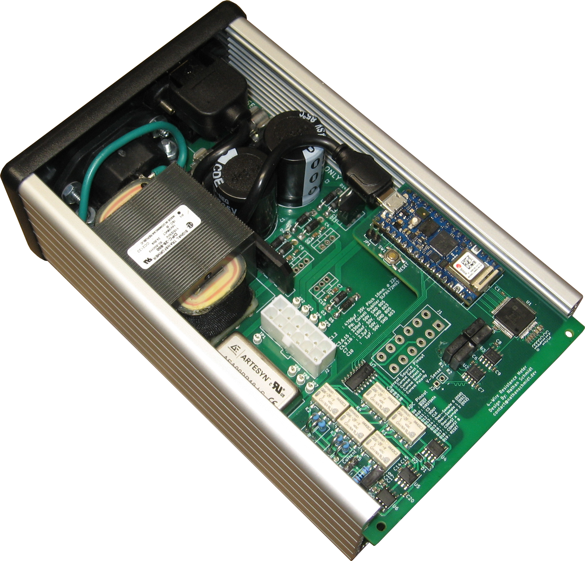
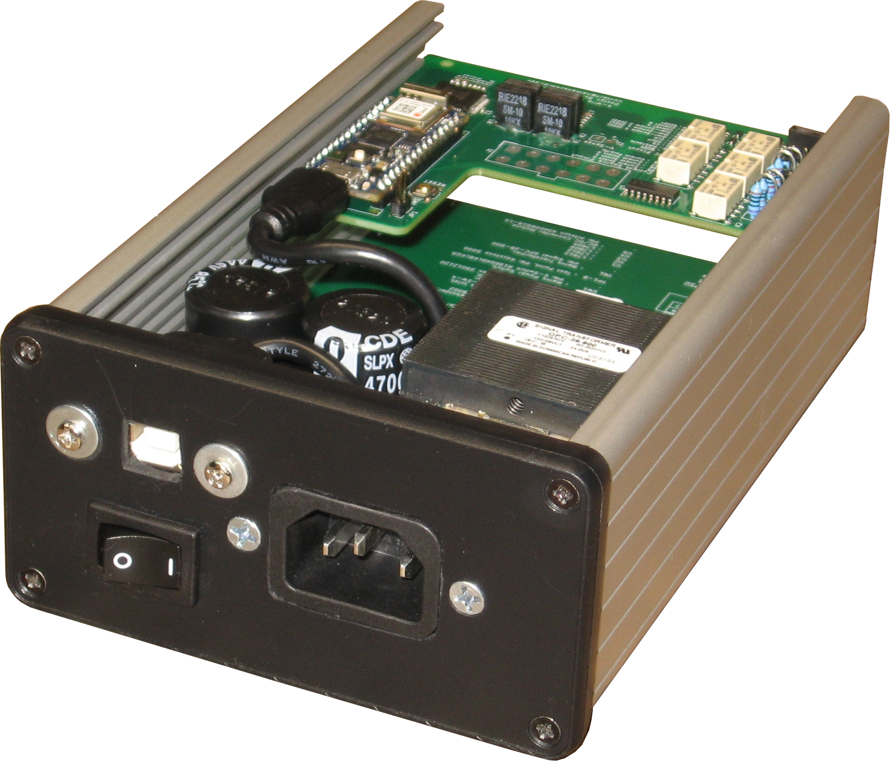

  <h4 style="text-align: center;">4-Wire Resistance Meter</h4>
  
  

    A self-contained 4-Wire resistance meter.
  

  

 

  <h4 style="text-align: center;">FISH Dialogue</h4>
  <iframe width="560" height="315" style="display:block;margin:auto;" src="https://www.youtube.com/embed/VHSHPGPk6w0" title="YouTube video player" frameborder="0" allow="accelerometer; autoplay; clipboard-write; encrypted-media; gyroscope; picture-in-picture" allowfullscreen></iframe>   
  

    This one has a story.
  

  

 
