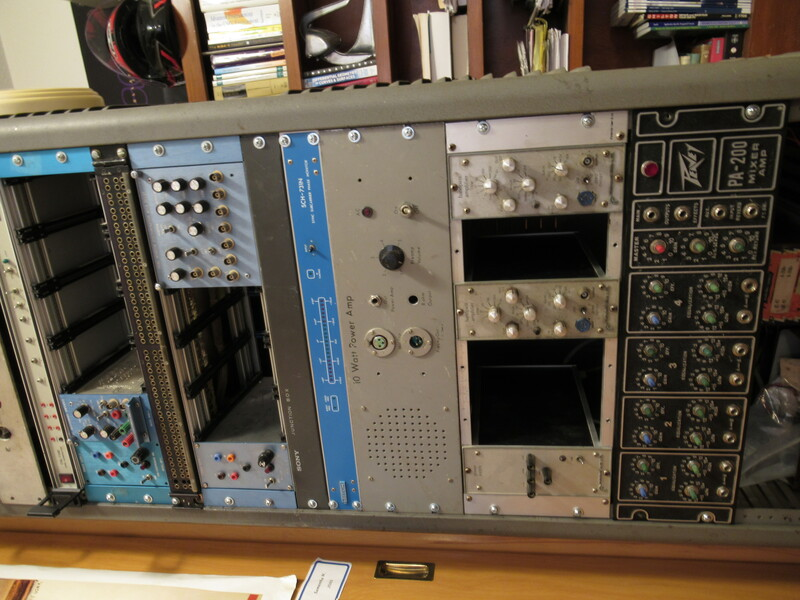
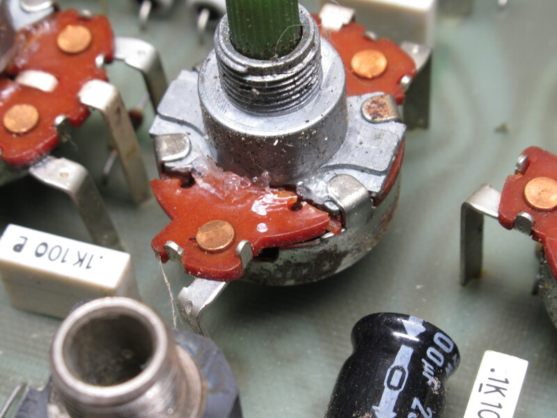
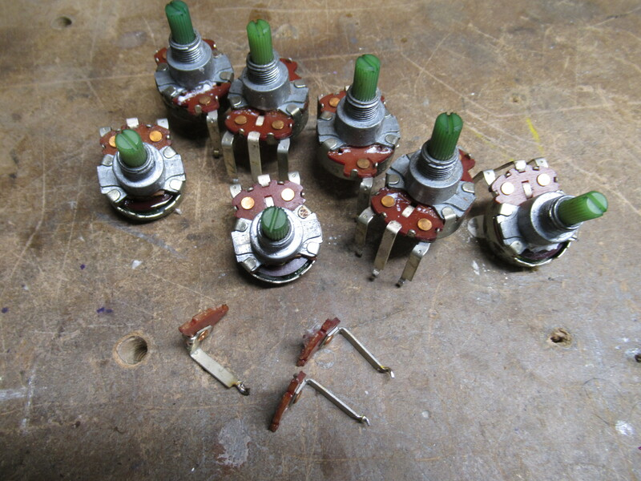

  <h3 style="text-align: center;">Peavey PA-200</h3>
   

  

    The PA-200 is quite an interesting effects amplifier.
    One of the features of note is the reverb effect.
    Instead of implementing its reverb through circuitry, it is done electro-mechanically.
    As soon as you move it, springs can be felt and faintly heard shaking in the case.
  

   

  

    Also of interest is that the front panel of the amplifier fits perfectly in a 19-inch rack.
    I'm guessing this is a result of using pre-made enclosures to reduce cost,
    but I'm not going to complain about someone following reasonable standards.
  

  
   

  

    I was told that the second and third channels were dead,
    but that the first and fourth worked just fine.
    That seemed to directly coincide with the second and third
    channels having severely damaged potentiometers.
  

  

    While there were broken potentiometers on the other
    channels, they still managed to function despite falling
    to pieces as soon as their legs were desoldered.
  

