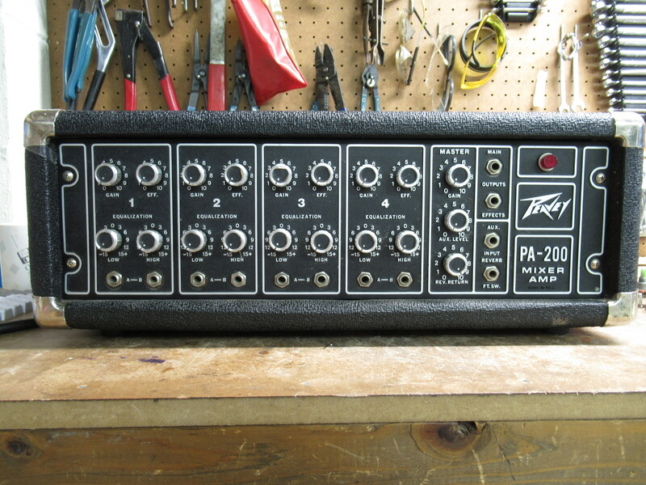
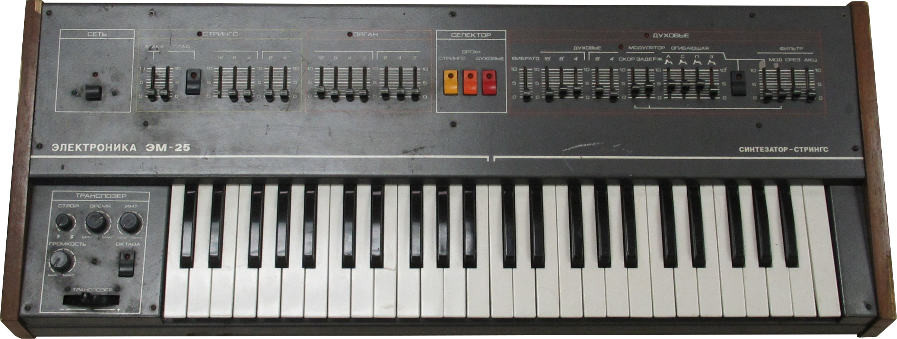
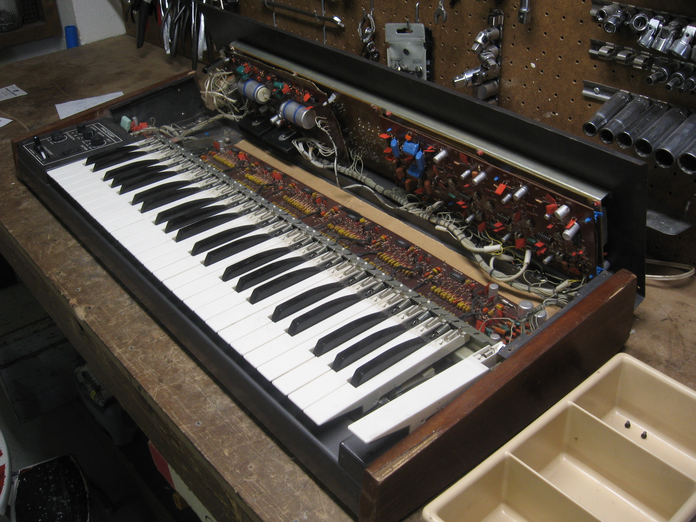
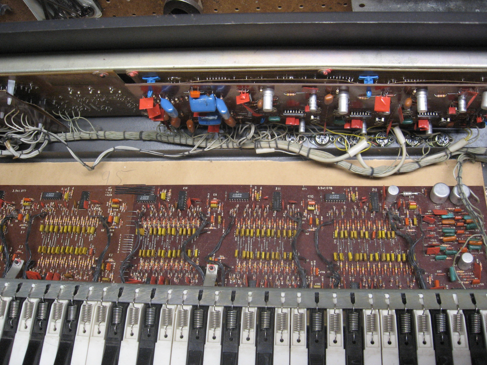

  

    A collection of some of the things I have been fixing lately.
  

  <a href="./King_Pin/king_pin.html">
    <h3 style="text-align: center;">Gottlieb's King Pin</h3></a>
   

  

    Gottlieb's 1973 <i>King Pin</i> pinball machine was one
    of the later electro-mechanical tables to be produced.
    All logic and timing is implemented with relays, switches, and motors.
    With some effort, I managed to get fifty years worth of crud out of its cogs.
  

  <a href="./PA_200/pa_200.html">
    <h3 style="text-align: center;">Peavey PA-200</h3></a>
   

  

    The Peavey PA-200 is a mixer/amplifier which uses springs
    to implement an electro-mechanical reverb effect.
    I was asked to repair one with two non-functioning channels.
  

  <h3 style="text-align: center;">Elektronika EM-25 Soviet Synthesizer</h3>
   

  

    The Elektronika EM-25 is a analog synthesizer built in the USSR through the mid to late 1980's.
    This one in particular was destroyed for good when the previous owner tried to take a peek inside.
    Note that there is a large metal frame on the underside of the control panel.
    All of the screws holding that frame go in from the top of the control panel.
    Thus if you didn't know any better,
    you may drop that heavy steel frame on the fragile
    circuitry below while trying to unfasten the control panel.
  

  

    As cool as it is, there are <i>hundreds</i> of broken
    capacitors and other damaged components in there.
    If that's not enough of a pain, also note that
    all of the documentation is written in Russian!
  

  
    

