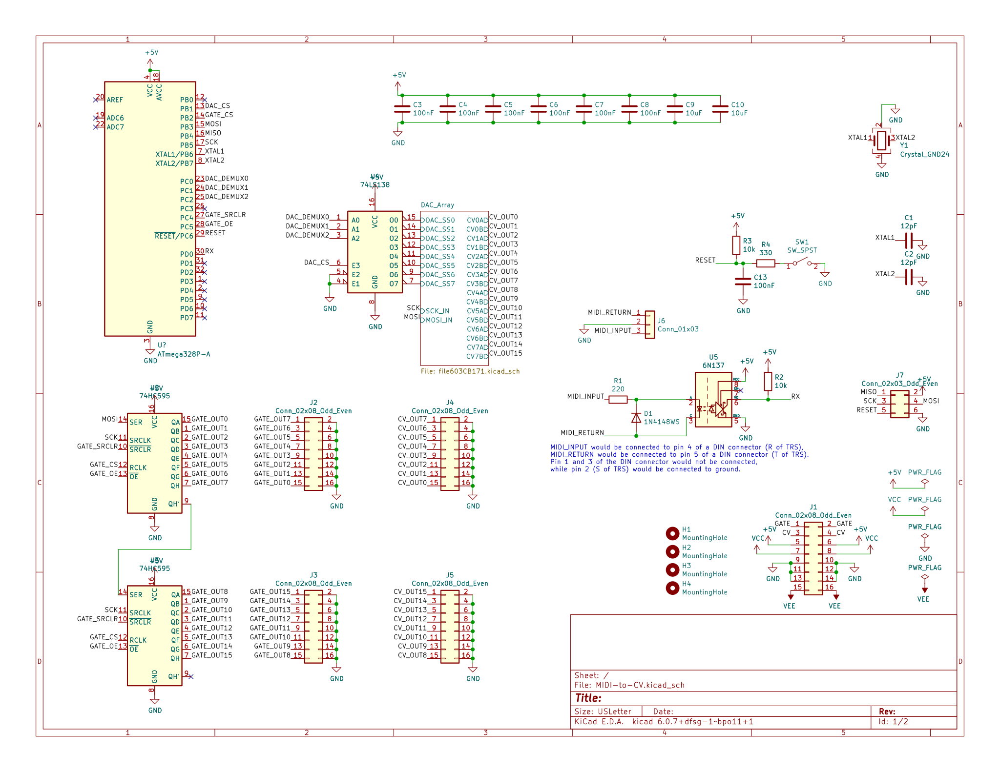

  

    I am currently in the process of designing a modern modular synthesizer.
    This does include the design of the standard VCOs, VCAs, VCFs, and ADSRs;
    but the main focus will be on the integration of computers into modular systems.
  

  

    A VCA and a fuzz filter have been designed in addition to the modules posted here.
    However, before I go any further with the development of any modular synthesizer PCB,
    I must first fix an issue with the PCB template I made for them.
    I've been thinking about ways which the layout could be improved,
    of which there seems to be a few.
    Since the template has to be changed eventually,
    fixing it now seems like the only reasonable thing to do.
    Otherwise I would just be making PCBs which were destined to require a remake,
    which isn't entirely that inspiring.
  

  

    <strong>Update (January 2023):</strong> after a substantial amount of contemplation on the matter,
    I've designed a new template to base modules on.
    I've made one new module with it, which seems to have turned out well;
    although I'm still waiting for the manufactured board to arrive to make a comprehensive assessment.
  

  <h3 style="text-align: center;">Current Modules</h3>
  <a href="#TH555VCO">Thomas Henry 555 VCO</a>   
  <a href="#PSYCHE">MIDI to CV Converter</a>   
  <a href="#VCF">Music From Outer Space State-Variable VCF</a>

  <h3 style="text-align: center;" id="TH555VCO">Thomas Henry 555 VCO</h3>
  
  

  

    As originally posted
    <a href="http://electro-music.com/forum/viewtopic.php?t=54623">here</a>
    by <a href="https://sdiy.info/wiki/Thomas_Henry">Thomas Henry</a>,
    the <i>Thomas Henry 555 VCO</i> is an excellent approximation of the CEM3340 IC VCO.
    I transcribed Mr. Henry's schematic over to Kicad, which I've linked below in a ZIP
    archive along with A PDF version.
  

  
   
  
(<a href="./assets/TH555VCO_Schematic_Kicad.zip">ZIP of PDF+Kicad Schematic</a>)

   

  

    The pictured PCB was created from the linked Kicad schematic and was manufactured by JLCPCB.
    Although I obviously have the PCBNew files, I am still changing around too many things on
    the PCB to leave them or the GERBER files here for someone to use.
    Getting the generic template to its final form would be a good first step towards this.
  

  

    Although I obviously didn't design the circuit, I have a certain fondness for it.
    For my physics degree I had an electronics course where I could choose the semesters
    final project. I had attempted building this VCO previous to then, but I only
    managed to construct a impossible to debug ratsnest. I decided it would be a good
    opportunity to try again. Some weeks later at the end of finals week, I finished
    bread-boarding the circuit and completed a report on its operation.
  

   
  <i>The finished final project for my Electronics course</i>

 

  <h3 style="text-align: center;" id="PSYCHE">MIDI to CV Converter (Psyche Controller)</h3>
  

  

    The <i>Psyche Controller</i> is a sixteen channel MIDI to CV converter.
    MIDI input is interpreted by an Atmel ATmega328P,
    which allows for firmware to be easily uploaded with
    the Arduino IDE and an Arduino-as-ISP programmer.
    All sixteen outputs have their own separate 12-bit DAC and buffered output.
    There are also an additional sixteen gate outputs implemented with two 74HS595 registers;
    although their behavior should be considered to be external to the MIDI standard.
  

  
  
   
  
(<a href="./assets/Psyche_Controller_Schematic_Kicad.zip">ZIP of PDF+Kicad Schematic</a>)

   

  <h3 style="text-align: center;" id="VCF">Music From Outer Space State-Variable VCF</h3>
  

  

    This is a clone of Ray Wilson's 12db/Octave State Variable Voltage Controlled Filter.
    The original schematic was found at <a href="http://musicfromouterspace.com/index.php?MAINTAB=SYNTHDIY&PROJARG=STATEVARVCFFEB2006/STATEVARVCFFEB2006.html&CATPARTNO=PCBMFSTVARVCF&PN=1&SONGID=NONE">Music From Outer Space</a>.
  

  
   
  
(<a href="./assets/MFOS_SV_VCF.zip">ZIP of PDF+Kicad Schematic</a>)

 
