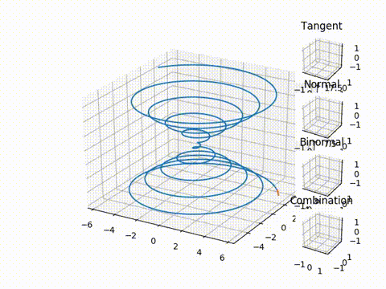

  

    I am by no means a professional mathematician,
    but I am certainly interested in advancing mathematics in any way I can.
    Some of my favorite areas are Knot theory, Graph Theory,
    Euclidean Geometry, and Partial Differential Equations.
  

  

    My favorite way to attack math problems is by programming.
    Specifically in the sense of finding algorithms through experimental programming.
    Recently I've been looking into software verification by formal proof;
    although I expect most of my writing on this will be in the
    <a href="/Programming/program.html">programming</a> section.
  

  <h3 style="text-align: center;">Differential Geometry</h3>
  

    Spring of 2019 I had a course in Differential Geometry.
    The class was graded in such a way that I had quite a
    bit of freedom to learn the subject however I wished,
    including through programming assignments.
    This resulted in a significant amount of tinkering with
    <a href="https://matplotlib.org">matplotlib</a>
    to make a 2D and 3D curve tracer in python.

   
  <i>A simple curve being traced</i>

  

    <a href="./assets/ct.py">Here</a>
    is the program used to generate the above animation.
    Currently the function it traces must be hard-coded in main().
    There are examples of functions for 2D and 3D traces included in the program.
  

  <h3 style="text-align: center;">Knot Theory</h3>
  
<a href="./Knots/knots.html">More on Knot Theory</a>

  

    My major goals with knot theory involve creating
    a general set of tools for parsing through knots.
    At this point it looks like this will involve expanding
    or re-creating the python Knot Theory package.
    The first step I am taking is to write a tool to convert
    Dowker-Thistlethwaite (dt) codes into Planar-Diagram (pd) codes.
    This will also help further another project to
    write a faster version of a python program to
    <a href="https://github.com/genjohnson/naive_bridge_computation">
      compute an upper bound for the bridge index of knots
    </a>
    of a given crossing number.
  

