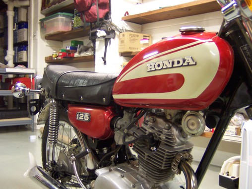
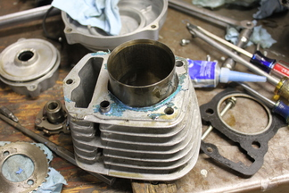
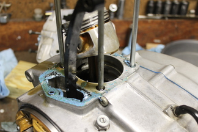
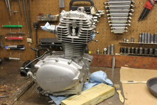
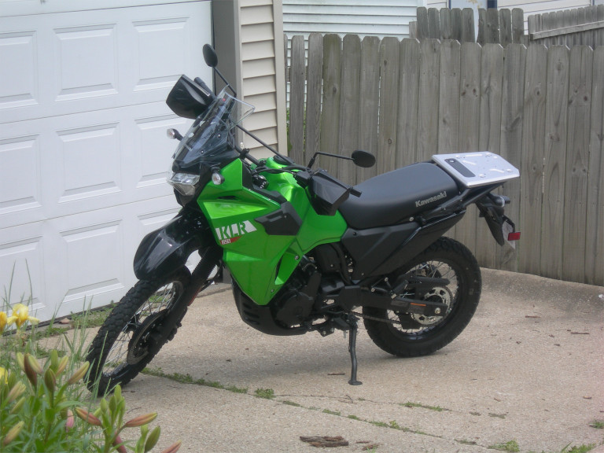

  

    I have a small collection of vehicles;
    all of which were at least twice as old as I was when purchased.
    Regardless, they seem to hold up quite well.
  

  <h3 style="text-align: center;">Honda CL-125 Scrambler (1974)</h3>
   
  
<i>When on-road off-road bikes had chrome</i>

  

    I bought this scrambler not too long after my 16th birthday for $600.
    It only had 6,000 miles on it at that point,
    although it was somewhat neglected.
    I recall the cam-chain was quite loud when I rode it for the first time.
    The front fork rubbers had rotted away and old cut up inner tubes
    were tied in place over the severely rusted fork tubes.
  

  

    I think it only took a few days to clean up,
    and maybe a couple hundred dollars.
    So for a tenth of the price of a new motorcycle,
    I got something that actually has character.
    Not too bad of a deal, I think.
  

   
  

    
    
  

   
  

    The winter of 2017-18 involved a few more notable repairs.
    The aftermarket gasket at the base of the cylinder essentially rotted away,
    causing the head gasket to blow out as the cylinder ever-so-slightly moved downward.
  

  

     
  

  

    On a positive note, it gave me an excuse to poke around
    and see how much wear had occurred throughout the engine.
    Even after 10,000 miles it looks like it could ride on forever.
  

  <h3 style="text-align: center;">Kawasaki KLR 650 (2023)</h3>
   
  
<i>Fresh from the Kawasaki dealership</i>

  

  <strong>Mileage so far (January 2026): 21,360</strong> 
  <strong>Average miles per day: 36</strong>
  

  

  I think I can confidently say I started riding
  "seriously" after getting my KLR.
  I decided to buy it after my employer at the time
  requested I, as a remote worker, commute once per
  week with compensation for mileage.
  As I lived over a hundred miles away from their location,
  I figured that the mileage compensation would be just about
  enough to rent a car and pay for gas;
  <emph>however,</emph> it would also be over three times
  as much as a payment for a brand-new KLR.
  

  

  It seemed quite obvious that riding through the countryside
  on a brand new motorcycle - where the act of doing so paid
  for it and then some - was preferable to renting a car,
  so that's what I ended up doing.
  

